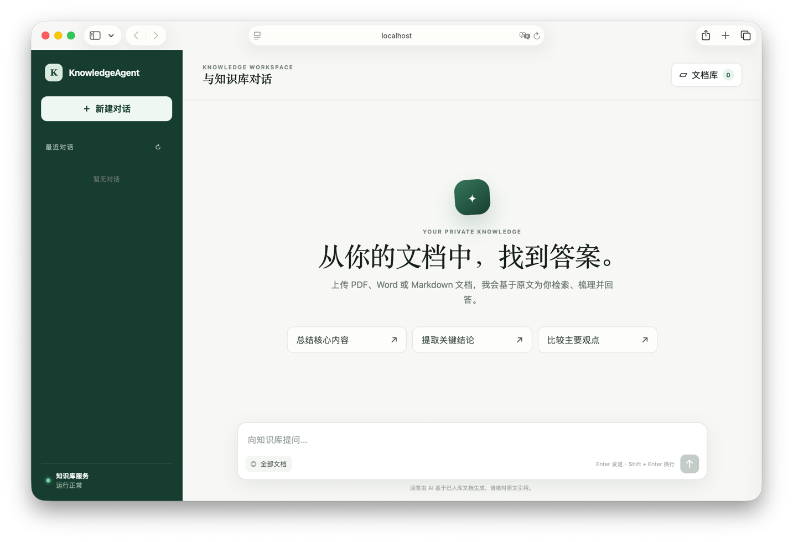

# KnowledgeAgent

KnowledgeAgent 是一个面向个人知识库的多模态 RAG 应用。上传 PDF、Word 或 Markdown 文档后，系统会解析正文与图片、建立 dense + sparse 双路向量索引，并通过网页对话返回带引用的答案。



## 功能亮点

- 支持 PDF、DOC、DOCX、Markdown，以及包含相对路径图片的 Markdown 文件夹。
- MinerU 提取正文、标题、列表、表格、图片说明和页码信息。
- 图片与文本通过多模态 embedding 融合；纯文本采用批量 embedding。
- dense + sparse 双路召回、加权 RRF 合并、模型重排。
- 支持 SSE 流式回答、文档图片引用、联网来源链接和 LaTeX 公式渲染。
- MongoDB 持久化文档、对话、消息、引用和 token usage。
- MinIO 保存原文件及解析图片，删除文档时同步清理对象和向量。
- LangGraph 编排入库与 RAG 工作流，支持请求幂等和有界并发。
- 内置管理台，可查看入库耗时、模型输入输出和运行指标。

## 快速开始

### 1. 环境要求

- Python 3.11+
- Node.js 18+
- [uv](https://docs.astral.sh/uv/)
- Docker 与 Docker Compose（可选，用于启动本地 MongoDB 和 MinIO）
- 可用的 Zilliz Cloud / Milvus、MinerU 和阿里云百炼服务

### 2. 获取代码并创建配置

```bash
git clone https://github.com/t745851718/KnowledgeAgent.git
cd KnowledgeAgent
cp .env.example .env
```

编辑 `.env`，至少替换以下占位值：

- `CHANGE_ME_MONGODB_PASSWORD`
- `CHANGE_ME_MINIO_SECRET`
- `CHANGE_ME_ZILLIZ_URI`
- `CHANGE_ME_ZILLIZ_TOKEN`
- `CHANGE_ME_BAILIAN_API_KEY`
- `CHANGE_ME_MINERU_API_KEY`
- `BAILIAN_BASE_URL` 中的工作空间地址

完整变量及默认值见 [`.env.example`](.env.example)。真实 `.env` 已被 Git 忽略，请勿提交密钥。

### 3. 启动 MongoDB 和 MinIO（可选）

已有可用服务时跳过本节，并在 `.env` 中填写对应连接信息。

```bash
docker compose --env-file .env -f tests/mongodb/docker-compose.yml up -d
docker compose --env-file .env -f tests/minio/docker-compose.yml up -d
```

本地服务入口：

- MongoDB：`127.0.0.1:27017`
- MinIO API：`http://127.0.0.1:9000`
- MinIO Console：<http://127.0.0.1:9001>

### 4. 安装依赖

```bash
uv sync --group dev
npm ci
```

如果 uv 默认缓存目录不可写：

```bash
UV_CACHE_DIR=/private/tmp/knowledgeagent-uv-cache uv sync --group dev
```

### 5. 启动应用

终端一，启动 FastAPI：

```bash
uv run uvicorn app.server.main:app --host 127.0.0.1 --port 8000 --reload
```

终端二，启动 Express 和前端：

```bash
npm start
```

FastAPI 和 Express 都会读取仓库根目录的 `.env`，不需要在两个终端重复设置变量。

### 6. 打开页面

| 地址 | 用途 |
| --- | --- |
| <http://127.0.0.1:3001/> | 知识库问答页面 |
| <http://127.0.0.1:3001/admin/> | 入库与 RAG 管理台 |
| <http://127.0.0.1:8000/docs> | FastAPI OpenAPI 文档 |
| <http://127.0.0.1:8000/internal/v1/health/ready> | 依赖就绪检查 |

上传文档后，前端会轮询处理状态。文档显示“已入库”后即可开始提问。

## 配置说明

配置分为五组，完整模板见 [`.env.example`](.env.example)：

| 分组 | 关键变量 | 用途 |
| --- | --- | --- |
| MongoDB | `MONGODB_URI`、`MONGODB_DATABASE` | 文档、对话与消息元数据 |
| MinIO | `MINIO_ENDPOINT`、`MINIO_ACCESS_KEY`、`MINIO_SECRET_KEY`、`BUCKET_NAME` | 原文件、附件和解析图片 |
| Zilliz / Milvus | `ZILLIZ_URI`、`ZILLIZ_TOKEN`、`ZILLIZ_COLLECTION` | 文本块与双路向量 |
| 百炼 | `BAILIAN_BASE_URL`、`BAILIAN_API_KEY`、模型变量 | embedding、rerank 和回答生成 |
| MinerU | `MINERU_API_KEY`、`MINERU_API_BASE` | PDF 与 Word 解析 |

源码默认模型：

| 用途 | 配置变量 | 默认值 |
| --- | --- | --- |
| Dense embedding | `EMBEDDING_MODEL` | `qwen3-vl-embedding` |
| Sparse embedding | `SPARSE_EMBEDDING_MODEL` | `qwen3.7-text-embedding` |
| Rerank | `RERANK_MODEL` | `qwen3.7-text-rerank` |
| Chat | `CHAT_MODEL` | `deepseek-v4-flash` |

这些值是项目配置默认值，不代表外部账号一定已开通对应模型。更换 embedding 模型或维度时应使用新 Collection 或全量重建，避免混用不同向量空间。

常用运行参数：

| 变量 | 默认值 | 说明 |
| --- | --- | --- |
| `MAX_UPLOAD_SIZE` | `209715200` | 单次上传总大小上限，单位为字节 |
| `CHUNK_SIZE` | `1200` | 文本块大小 |
| `CHUNK_OVERLAP` | `200` | 文本块重叠大小 |
| `RETRIEVAL_LIMIT` | `30` | 混合检索候选数量 |
| `RERANK_LIMIT` | `6` | 重排后保留数量 |
| `DENSE_RRF_WEIGHT` | `1.0` | Dense RRF 权重 |
| `SPARSE_RRF_WEIGHT` | `1.0` | Sparse RRF 权重 |
| `RRF_K` | `60` | RRF 平滑常数 |
| `WEB_PORT` | `3001` | Express 监听端口 |
| `SERVER_BASE_URL` | `http://127.0.0.1:8000` | Express 转发的 FastAPI 地址 |
| `DEVELOPMENT_OWNER_ID` | `development-user` | 开发模式固定用户标识 |
| `INTERNAL_API_TOKEN` | 空 | Express 与 FastAPI 共享的内部 Bearer Token |

缺少 `MONGODB_URI` 时服务会使用内存仓储，但就绪检查会返回 503，重启后数据也会丢失。完整运行仍需要正确配置 MinIO、Zilliz、MinerU 和百炼。

## 系统架构

```text
Browser
  │
  │ /api/v1
  ▼
Express Web :3001
  │ 身份注入、响应包装、SSE 转发、静态页面
  │ /internal/v1
  ▼
FastAPI :8000
  ├─ MongoDB             文档、会话、消息、引用、usage
  ├─ MinIO               原文件、Markdown 附件、解析图片
  ├─ MinerU              PDF / Word 解析
  ├─ Bailian / DashScope dense、sparse、rerank、chat
  └─ Zilliz / Milvus     文本块、元数据与混合检索
```

### 文档入库

```text
上传并校验
  → 保存原文件到 MinIO
  → MinerU 解析或直接读取 Markdown
  → 恢复页面、标题和图文关联
  → 分块
  → dense / sparse 并行向量化
  → 按批写入 Zilliz
  → indexed
```

图片只绑定到对应描述块。含图块单独执行多模态融合，sparse 路只使用文字描述。直接上传 Markdown 支持 HTTP(S) 图片、Base64 Data URI 和文件夹内相对图片。

### 检索与回答

```text
问题
  → dense / sparse 查询向量
  → Zilliz 双路检索
  → 加权 RRF 合并
  → rerank
  → 拼接最近对话历史与引用
  → 模型生成
  → SSE / JSON 响应并持久化
```

问答可按请求开启模型内置联网检索。网络 URL citation 会转换为可点击来源；文档引用可携带对应解析图片。

## API 概览

浏览器应访问 Express 暴露的 `/api/v1`，不要直接依赖内部接口。完整契约见 [README/api.md](README/api.md)。

| 方法 | Web API | 说明 |
| --- | --- | --- |
| `GET` | `/api/v1/health` | Web 进程健康检查 |
| `POST` | `/api/v1/documents` | 上传文档，返回 HTTP 202 |
| `GET` | `/api/v1/documents` | 查询文档列表 |
| `DELETE` | `/api/v1/documents/:id` | 删除文档、向量和 MinIO 对象 |
| `POST` | `/api/v1/conversations` | 创建对话 |
| `GET` | `/api/v1/conversations/:id/messages` | 查询历史消息 |
| `POST` | `/api/v1/chat/completions` | RAG 问答，默认 SSE |
| `GET` | `/api/v1/admin/metrics` | 读取运行监控 |
| `GET/PUT` | `/api/v1/admin/config` | 读取或修改进程级配置 |

HTTP 202 只表示入库任务已接受。客户端应继续查询文档，直到状态变为 `indexed` 或 `failed`。

## 项目结构

```text
KnowledgeAgent/
├─ app/
│  ├─ admin/                 管理 API、运行指标和独立页面
│  ├─ server/
│  │  ├─ api/               FastAPI 路由、鉴权和错误处理
│  │  ├─ core/              配置、ID 与基础工具
│  │  ├─ domain/            请求响应模型
│  │  ├─ providers/         MinerU、百炼、Zilliz、MinIO 适配器
│  │  ├─ repositories/      MongoDB 与内存仓储
│  │  └─ services/          入库、RAG、健康检查和任务管理
│  └─ web/                  Express 代理与原生 HTML/CSS/JavaScript
├─ README/                  API 与设计文档
├─ tests/                   离线、集成和真实全流程测试
├─ .env.example             可提交的环境变量模板
├─ package.json             Web 依赖与命令
├─ pyproject.toml           Python 依赖与 pytest 配置
└─ uv.lock                  Python 锁文件
```

## 测试

运行所有离线 Python 测试：

```bash
RUN_FULL_FLOW=0 RUN_MINIO_INTEGRATION=0 uv run pytest -q
```

运行 Web 测试：

```bash
npm test
```

离线测试使用内存仓储和 Provider 替身，不调用 MinerU、百炼或 Zilliz 的付费接口。

真实全流程测试需要显式开启：

```bash
RUN_FULL_FLOW=1 uv run pytest -q -s tests/test_flows/test_real_flow.py
```

该测试会访问已配置的真实服务、产生外部调用并清理本次测试数据。更多选项见 [tests/test_flows/README.md](tests/test_flows/README.md)。

## 开发与部署注意事项

- `npm run dev` 可在 Web 文件变化时自动重启 Express。
- 管理台记录和运行时配置仅保存在 FastAPI 进程内，重启后清空。
- 项目尚未提供正式登录系统，开发模式使用固定的 `DEVELOPMENT_OWNER_ID`。
- 生产环境应为 `/admin/` 增加管理员认证，并避免将 FastAPI 内部接口直接暴露到公网。
- 入库任务、请求锁和写入锁是单进程状态；多 worker 部署前需要设计持久化任务恢复与分布式协调。
- MongoDB、MinIO 和 Zilliz 之间没有跨系统事务，失败清理采用尽力而为策略。
- 不要提交 `.env`、API Key、数据库密码、连接串或用户上传内容。

## 更多文档

- [API 接口与 SSE 契约](README/api.md)
- [服务端说明](app/server/README.md)
- [Web 与代理说明](app/web/README.md)
- [LangGraph 工作流](app/server/services/README.md)
- [架构设计](README/schema.md)
- [测试说明](tests/README.md)
- [后续计划](README/todo.md)

## License

仓库尚未包含开源许可证。公开分发前请添加 `LICENSE` 并明确授权范围。
