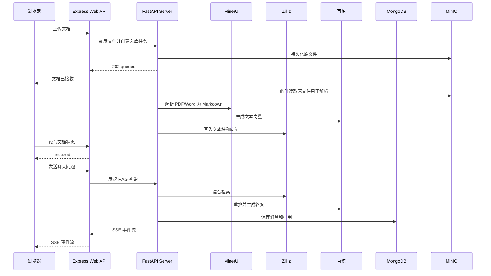

# KnowledgeAgent 接口文档

## 1. 文档说明

本文档描述 KnowledgeAgent 已实现的 v1 HTTP 接口，并与 `app/web`、`app/server` 的实际行为保持一致。产品目标和早期技术设想分别见 [`doc.md`](./doc.md) 与 [`schema.md`](./schema.md)；若它们与本文档冲突，以本文档和 FastAPI OpenAPI 为准。

接口已完成本地自动化测试和真实云端端到端联调，但仍属于开发阶段，尚未提供正式登录系统、持久化任务队列和生产级多实例协调。

系统分为两层接口：

- **Web API**：由 Express 提供，供浏览器调用。默认示例地址为 `http://localhost:3001/api/v1`。
- **Server API**：由 FastAPI 提供，供 Express 内部调用。默认示例地址为 `http://localhost:8000/internal/v1`，不应直接暴露到公网。

v1 已支持以下主要能力：

1. 上传 PDF、Word 或 Markdown 文档。
2. 查询文档解析和向量化状态。
3. 创建与查询会话。
4. 基于知识库进行 RAG 问答，并以 SSE 流式返回答案。
5. 返回答案引用的原文片段，便于用户核对来源。

---

## 2. 系统调用流程



---

## 3. 通用约定

### 3.1 请求格式

- 普通接口使用 `Content-Type: application/json`。
- 文件上传使用 `Content-Type: multipart/form-data`，该请求头及 boundary 应由浏览器或 HTTP 客户端自动生成。Markdown 文件夹上传可重复提交 `assets` 图片字段，并用 `asset_paths` JSON 数组按顺序提供包内相对路径，`markdown_path` 表示主文档在包内的路径。
- 流式聊天响应使用 `Content-Type: text/event-stream`。
- 字符编码统一为 UTF-8。
- 服务端生成带资源前缀的、可按时间排序的 ID，例如 `doc_...`、`conv_...`、`msg_...` 和 `req_...`；客户端只应将其视为不透明字符串。
- 时间字段使用 ISO 8601 UTC 格式，例如 `2026-03-10T08:30:00Z`。

### 3.2 身份认证

v1 暂未实现登录接口。Express 在开发环境中使用 `DEVELOPMENT_OWNER_ID`，默认值为 `development-user`，并通过 `X-Owner-Id` 向 FastAPI 传递可信身份。JSON 请求中的浏览器 `owner_id` 会被 Express 覆盖，multipart 上传也由请求头决定 owner。生产环境必须改为从经过验证的服务端登录态取得 owner ID，不得信任客户端提交的用户 ID。

FastAPI 支持通过 `INTERNAL_API_TOKEN` 启用内部 Bearer Token：

```http
Authorization: Bearer <internal-service-token>
```

未配置内部鉴权时，FastAPI 应只监听内网地址或本机地址。

### 3.3 成功响应

Web API 的非流式接口使用统一响应结构；FastAPI 内部接口直接返回业务数据或错误结构，由 Express 负责包装：

```json
{
  "code": "OK",
  "message": "success",
  "data": {}
}
```

字段说明：

| 字段 | 类型 | 说明 |
| --- | --- | --- |
| `code` | string | 业务状态码，成功固定为 `OK` |
| `message` | string | 人类可读的结果说明 |
| `data` | object、array 或 null | 业务数据 |

创建异步任务时返回 HTTP `202 Accepted`；创建普通资源时返回 HTTP `201 Created`；查询成功返回 HTTP `200 OK`；删除成功且无需响应体时返回 HTTP `204 No Content`。

### 3.4 错误响应

```json
{
  "code": "UNSUPPORTED_FILE_TYPE",
  "message": "仅支持 PDF、Word 和 Markdown 文件",
  "details": {
    "filename": "notes.txt"
  },
  "request_id": "req_01JNY9QH8KJ9W1M8T5MZA0Q0ME"
}
```

| HTTP 状态码 | 业务码 | 使用场景 |
| --- | --- | --- |
| `400` | `INVALID_ARGUMENT` | 请求参数格式正确，但取值不合法 |
| `401` | `UNAUTHORIZED` | 未登录、令牌缺失或令牌无效 |
| `403` | `FORBIDDEN` | 无权访问指定文档或会话 |
| `404` | `DOCUMENT_NOT_FOUND` | 文档不存在 |
| `404` | `CONVERSATION_NOT_FOUND` | 会话不存在 |
| `409` | `DOCUMENT_NOT_READY` | 指定文档尚未完成入库 |
| `409` | `REQUEST_ID_CONFLICT` | 同一请求 ID 被用于不同的问答参数 |
| `413` | `FILE_TOO_LARGE` | 文件超过服务端配置的大小限制 |
| `415` | `UNSUPPORTED_FILE_TYPE` | 文件扩展名或 MIME 类型不受支持 |
| `422` | `VALIDATION_ERROR` | JSON 或表单字段校验失败 |
| `500` | `INTERNAL_ERROR` | 未分类的服务内部错误 |
| `502` | `UPSTREAM_SERVICE_ERROR` | MinerU 或百炼调用失败 |
| `503` | `UPSTREAM_SERVICE_ERROR` | Zilliz、Volume 或本地存储调用失败 |
| `503` | `SERVICE_UNAVAILABLE` | 就绪检查发现必要依赖不可用 |

Express 和 FastAPI 都会在响应头返回 `X-Request-Id`，错误响应也包含该值。现有 Provider 适配器尚未把它作为上游请求头传给 MinerU、百炼或 Zilliz。

### 3.5 分页

列表接口使用游标分页：

| 参数 | 位置 | 类型 | 必填 | 默认值 | 说明 |
| --- | --- | --- | --- | --- | --- |
| `limit` | query | integer | 否 | `20` | 每页数量，范围 `1`～`100` |
| `cursor` | query | string | 否 | 无 | 上一页响应中的 `next_cursor` |

列表响应示例：

```json
{
  "code": "OK",
  "message": "success",
  "data": {
    "items": [],
    "next_cursor": null,
    "has_more": false
  }
}
```

### 3.6 幂等与重试

- 文档上传可携带 `Idempotency-Key` 请求头。相同用户在 24 小时内使用相同 key 重试时，服务端返回第一次创建的文档任务；未提供 key 时允许上传内容相同的文件。
- GET 请求可以安全重试。
- 遇到 `429`、`502` 或 `503` 时，客户端应使用指数退避重试，并优先遵循响应头 `Retry-After`。
- SSE 连接中断后，客户端可以重新发起聊天请求；若要避免生成重复消息，应复用同一个 `request_id`。

---

## 4. 数据模型

### 4.1 Document

```json
{
  "id": "doc_01JNYA2P4SXR8RJ5T08ZK7B8QB",
  "name": "AttentionIsAllYouNeed.pdf",
  "content_type": "application/pdf",
  "size": 2215244,
  "status": "indexed",
  "stage": "completed",
  "progress": 100,
  "chunk_count": 86,
  "total_images": 4,
  "missing_images": 1,
  "error": null,
  "created_at": "2026-03-10T08:30:00Z",
  "updated_at": "2026-03-10T08:31:42Z"
}
```

| 字段 | 类型 | 说明 |
| --- | --- | --- |
| `id` | string | 文档唯一 ID |
| `name` | string | 原始文件名 |
| `content_type` | string | 文件 MIME 类型 |
| `size` | integer | 文件字节数 |
| `status` | string | 文档总体状态，见下表 |
| `stage` | string | 当前处理阶段 |
| `progress` | integer | 估算进度，范围 `0`～`100` |
| `chunk_count` | integer 或 null | 成功写入向量库的文本块数量 |
| `total_images` | integer | Markdown 中解析到的图片引用总数 |
| `missing_images` | integer | 未在上传包内找到的相对图片数 |
| `error` | object 或 null | 失败原因；仅失败时有值 |
| `created_at` | string | 创建时间 |
| `updated_at` | string | 最后更新时间 |

文档状态：

| 状态 | 含义 | 是否终态 |
| --- | --- | --- |
| `queued` | 已接收，等待处理 | 否 |
| `processing` | 正在解析、切分、向量化或入库 | 否 |
| `indexed` | 已成功写入知识库，可用于问答 | 是 |
| `failed` | 处理失败，查看 `error` | 是 |
| `deleting` | 正在删除原文件和向量 | 否 |

`stage` 可取 `uploading`、`parsing`、`splitting`、`embedding`、`indexing`、`completed`。失败时保留失败发生前的阶段。

Markdown 解析后，`total_images` 表示图片引用总数，`missing_images` 表示包内未找到的相对图片数。缺图不再导致整篇入库失败；图片描述仍作为文本入库，Web 会提示缺失数量。

### 4.2 Conversation

```json
{
  "id": "conv_01JNYA9TMXNYBWBS45NY79BTRF",
  "title": "Transformer 论文问答",
  "created_at": "2026-03-10T09:00:00Z",
  "updated_at": "2026-03-10T09:03:12Z"
}
```

### 4.3 Message

```json
{
  "id": "msg_01JNYAB0PR7K8D3Q0RG37K0ZMY",
  "conversation_id": "conv_01JNYA9TMXNYBWBS45NY79BTRF",
  "role": "assistant",
  "content": "自注意力机制会根据查询与键的相关性，对值进行加权汇总。",
  "citations": [
    {
      "document_id": "doc_01JNYA2P4SXR8RJ5T08ZK7B8QB",
      "document_name": "AttentionIsAllYouNeed.pdf",
      "chunk_id": "chunk_01JNYA7N7BJS83NKFSWD8W70HN",
      "page": 4,
      "score": 0.92,
      "text": "An attention function can be described as mapping a query..."
    }
  ],
  "created_at": "2026-03-10T09:03:12Z"
}
```

`role` 可取 `user`、`assistant`、`system`。其中 `system` 消息通常只在服务端内部使用，不应允许浏览器直接写入。

知识库引用的 `source_type` 为 `knowledge`。开启联网后，Responses API 返回的 URL
annotations 或 `web_search_call.action.sources` 会转换为 `source_type=web` 的引用，
并增加 `url` 字段；服务只接受不含用户凭据的 HTTP(S) 地址。联网引用随 SSE 返回、
写入 assistant 消息，并由 Web 在回答底部展示为可点击的“网络来源”。

---

## 5. Web API（浏览器调用）

### 5.1 健康检查

#### `GET /api/v1/health`

用于负载均衡探活或前端判断 Web 服务是否可访问。该接口只检查 Express 进程本身，不执行昂贵的外部服务调用。

响应：`200 OK`

```json
{
  "code": "OK",
  "message": "success",
  "data": {
    "status": "ok",
    "service": "knowledgeagent-web",
    "timestamp": "2026-03-10T08:30:00Z"
  }
}
```

### 5.2 上传文档

#### `POST /api/v1/documents`

接收一个文档并创建异步入库任务。接口在原文件完成 MinIO 持久化、MongoDB 文档记录创建完成且进程内任务成功登记后返回，不等待 MinerU 解析和向量化结束。

请求头：

```http
Content-Type: multipart/form-data
Idempotency-Key: 91862a89-1cb1-4b43-9498-d5f733e91963
```

表单字段：

| 字段 | 类型 | 必填 | 说明 |
| --- | --- | --- | --- |
| `file` | binary | 是 | PDF、Word 或 Markdown 文件 |
| `metadata` | JSON string | 否 | 自定义元数据，例如来源、标签 |
| `assets` | binary，可重复 | 否 | Markdown 文件夹内的图片资源 |
| `asset_paths` | JSON string[] | 否 | 与 `assets` 按顺序对应的包内安全相对路径 |
| `markdown_path` | string | 否 | 主 Markdown 在上传包内的相对路径 |

已支持的文件类型：

| 文件类型 | 扩展名 | MIME 类型示例 | 解析方式 |
| --- | --- | --- | --- |
| PDF | `.pdf` | `application/pdf` | MinerU 转 Markdown |
| Word | `.doc`、`.docx` | `application/msword`、`application/vnd.openxmlformats-officedocument.wordprocessingml.document` | MinerU 转 Markdown |
| Markdown | `.md`、`.markdown` | `text/markdown`、`text/plain` | 直接读取并统一切分 |

服务端同时校验扩展名、MIME 类型和文件内容特征。文件大小上限由部署配置决定；超过限制返回 `413 FILE_TOO_LARGE`。

响应：`202 Accepted`

```json
{
  "code": "OK",
  "message": "文档已接收，正在处理",
  "data": {
    "document_id": "doc_01JNYA2P4SXR8RJ5T08ZK7B8QB",
    "status": "queued",
    "status_url": "/api/v1/documents/doc_01JNYA2P4SXR8RJ5T08ZK7B8QB"
  }
}
```

cURL 示例：

```bash
curl -X POST 'http://localhost:3001/api/v1/documents' \
  -H 'Idempotency-Key: 91862a89-1cb1-4b43-9498-d5f733e91963' \
  -F 'file=@./tests/data/AttentionIsAllYouNeed.pdf' \
  -F 'metadata={"source":"manual-upload","tags":["paper","transformer"]}'
```

### 5.3 查询文档列表

#### `GET /api/v1/documents`

查询当前用户上传的文档。默认按 `created_at` 倒序排列。

查询参数：

| 参数 | 类型 | 必填 | 说明 |
| --- | --- | --- | --- |
| `status` | string | 否 | 按 `queued`、`processing`、`indexed`、`failed` 或 `deleting` 过滤 |
| `limit` | integer | 否 | 每页数量 |
| `cursor` | string | 否 | 分页游标 |

响应：`200 OK`

```json
{
  "code": "OK",
  "message": "success",
  "data": {
    "items": [
      {
        "id": "doc_01JNYA2P4SXR8RJ5T08ZK7B8QB",
        "name": "AttentionIsAllYouNeed.pdf",
        "content_type": "application/pdf",
        "size": 2215244,
        "status": "indexed",
        "stage": "completed",
        "progress": 100,
        "chunk_count": 86,
        "error": null,
        "created_at": "2026-03-10T08:30:00Z",
        "updated_at": "2026-03-10T08:31:42Z"
      }
    ],
    "next_cursor": null,
    "has_more": false
  }
}
```

### 5.4 查询单个文档及处理进度

#### `GET /api/v1/documents/{document_id}`

上传成功后，前端可以每 2～5 秒调用一次该接口，直到状态变为 `indexed` 或 `failed`。

路径参数：

| 参数 | 类型 | 说明 |
| --- | --- | --- |
| `document_id` | string | 文档 ID |

响应：`200 OK`

```json
{
  "code": "OK",
  "message": "success",
  "data": {
    "id": "doc_01JNYA2P4SXR8RJ5T08ZK7B8QB",
    "name": "AttentionIsAllYouNeed.pdf",
    "content_type": "application/pdf",
    "size": 2215244,
    "status": "processing",
    "stage": "embedding",
    "progress": 75,
    "chunk_count": null,
    "error": null,
    "created_at": "2026-03-10T08:30:00Z",
    "updated_at": "2026-03-10T08:31:10Z"
  }
}
```

失败时 `error` 示例：

```json
{
  "code": "DOCUMENT_PARSE_FAILED",
  "message": "MinerU 未能解析该文档",
  "retryable": true
}
```

### 5.5 删除文档

#### `DELETE /api/v1/documents/{document_id}`

同步删除 MongoDB 文档记录、MinIO 原文件和对应的 Zilliz 向量。处理过程中内部状态为 `deleting`，所有清理成功后返回 204；失败时文档进入 `failed` 并返回错误。

响应：`204 No Content`

如果已有会话引用该文档，历史消息可以保留文档名称和引用文本快照，但不再提供原文件下载。

### 5.6 创建会话

#### `POST /api/v1/conversations`

请求：

```json
{
  "title": "Transformer 论文问答"
}
```

| 字段 | 类型 | 必填 | 说明 |
| --- | --- | --- | --- |
| `title` | string | 否 | 会话标题；省略或为空时使用“新会话” |

响应：`201 Created`

```json
{
  "code": "OK",
  "message": "会话已创建",
  "data": {
    "id": "conv_01JNYA9TMXNYBWBS45NY79BTRF",
    "title": "Transformer 论文问答",
    "created_at": "2026-03-10T09:00:00Z",
    "updated_at": "2026-03-10T09:00:00Z"
  }
}
```

### 5.7 查询会话列表

#### `GET /api/v1/conversations`

支持通用的 `limit`、`cursor` 参数，默认按 `updated_at` 倒序排列。响应中的 `items` 为 `Conversation` 数组。

### 5.8 查询会话消息

#### `GET /api/v1/conversations/{conversation_id}/messages`

支持通用的 `limit`、`cursor` 参数，默认按 `created_at` 正序返回。响应中的 `items` 为 `Message` 数组。

### 5.9 删除会话

#### `DELETE /api/v1/conversations/{conversation_id}`

删除 MongoDB 中的会话及消息记录，不删除知识库文档。

响应：`204 No Content`

### 5.10 RAG 问答

#### `POST /api/v1/chat/completions`

根据用户问题检索 Zilliz 中的知识片段，使用 rerank 模型重排，再由大语言模型生成答案。默认通过 SSE 返回；请求中显式设置 `stream=false` 时返回普通 JSON，结构与第 6.5 节一致。

请求头：

```http
Content-Type: application/json
Accept: text/event-stream
```

请求体：

```json
{
  "conversation_id": "conv_01JNYA9TMXNYBWBS45NY79BTRF",
  "message": "Transformer 为什么需要位置编码？",
  "document_ids": [
    "doc_01JNYA2P4SXR8RJ5T08ZK7B8QB"
  ],
  "request_id": "chat_01JNYAZPZMHQH25B8R0YZ97XPK"
}
```

| 字段 | 类型 | 必填 | 说明 |
| --- | --- | --- | --- |
| `conversation_id` | string | 是 | 已创建的会话 ID |
| `message` | string | 是 | 用户问题；去除首尾空白后不能为空 |
| `document_ids` | string[] | 否 | 限制检索范围；省略或空数组表示检索当前用户全部已入库文档 |
| `web_search_enabled` | boolean | 否 | 是否在本次 Responses API 生成中绑定内置 `web_search` 工具，默认 `false`；关闭时不传入联网工具 |
| `request_id` | string | 否 | 客户端生成的请求 ID，用于重连去重和问题排查 |
| `stream` | boolean | 否 | 是否使用 SSE；默认 `true` |

只有 `status=indexed` 的文档可以参与问答。若指定文档仍在处理中，返回 `409 DOCUMENT_NOT_READY`。

cURL 示例：

```bash
curl -N -X POST 'http://localhost:3001/api/v1/chat/completions' \
  -H 'Content-Type: application/json' \
  -H 'Accept: text/event-stream' \
  -d '{
    "conversation_id": "conv_01JNYA9TMXNYBWBS45NY79BTRF",
    "message": "Transformer 为什么需要位置编码？",
    "document_ids": ["doc_01JNYA2P4SXR8RJ5T08ZK7B8QB"]
  }'
```

#### SSE 事件格式

每个事件由 `event` 和 `data` 两行组成，事件之间用空行分隔。`data` 是单行 JSON。

1. `start`：已分配 assistant 消息 ID，开始生成；消息会在回答完成后持久化。默认标题为“新对话”或“新会话”时，服务会先用现有聊天模型生成侧栏摘要，`conversation_title` 随该事件返回。

```text
event: start
data: {"request_id":"chat_01JNYAZPZMHQH25B8R0YZ97XPK","message_id":"msg_01JNYB1BQE89CG1YBMTH07XF0H","conversation_title":"Transformer 位置编码"}

```

2. `delta`：答案文本增量。客户端应按到达顺序拼接 `content`。

```text
event: delta
data: {"content":"Transformer 本身不包含序列顺序信息，"}

event: delta
data: {"content":"因此需要位置编码表示 token 的位置。"}

```

3. `citations`：本次回答使用的引用，可在生成中或生成结束前发送一次。assistant 原始内容使用 `[[cite:N]]` 隐藏锚点与第 N 条知识库 citation 对应；Web 会删除锚点，并仅将该 citation 关联的图片插入锚点位置，同一图片在单条回答中只显示一次。`source_type=web` 的条目作为去重后的可点击“网络来源”展示。

```text
event: citations
data: {"items":[{"document_id":"doc_01JNYA2P4SXR8RJ5T08ZK7B8QB","document_name":"AttentionIsAllYouNeed.pdf","chunk_id":"chunk_01JNYA7N7BJS83NKFSWD8W70HN","page":6,"score":0.94,"text":"Since our model contains no recurrence and no convolution..."}]}

```

4. `done`：回答完成。收到后客户端应主动关闭连接。

```text
event: done
data: {"finish_reason":"stop","usage":{"prompt_tokens":1530,"completion_tokens":86,"total_tokens":1616}}

```

5. `error`：连接建立后发生错误。发送该事件后服务端关闭连接。

```text
event: error
data: {"code":"UPSTREAM_SERVICE_ERROR","message":"模型服务暂时不可用","request_id":"chat_01JNYAZPZMHQH25B8R0YZ97XPK","retryable":true}

```

如果错误发生在 SSE 响应头发送之前，服务端应返回普通 JSON 错误和对应 HTTP 状态码。如果错误发生在响应头发送之后，HTTP 状态通常已经是 `200`，客户端必须检查 `error` 事件。

浏览器使用 `fetch` 发起 POST 请求时，需要从 `response.body` 读取流；原生 `EventSource` 只能发起 GET 请求，不能直接用于该接口。

---

## 6. FastAPI Server API（Express 内部调用）

以下接口承载核心业务逻辑。Express 应保留并转发 `X-Request-Id`，同时将经过身份验证的用户标识放入可信请求头或服务端签名的载荷中。

Express 转发资源查询、删除和 multipart 上传时，应设置 `X-Owner-Id`。上传接口也兼容 `owner_id` 表单字段；如果请求头与表单字段同时存在但值不同，服务返回 `403 FORBIDDEN`。

### 6.1 服务就绪检查

#### `GET /internal/v1/health/ready`

检查 FastAPI、MongoDB、MinIO 和 Zilliz 的基本连通性。该检查不调用 MinerU、百炼等按次计费服务，响应中将其标记为 `not_checked`。

响应：`200 OK`

```json
{
  "status": "ready",
  "dependencies": {
    "mongodb": "up",
    "minio": "up",
    "zilliz": "up",
    "bailian": "not_checked",
    "mineru": "not_checked"
  }
}
```

依赖不可用时返回 `503 Service Unavailable`，并将对应值设为 `down`。

### 6.2 创建文档入库任务

#### `POST /internal/v1/documents/ingestions`

Express 将浏览器上传的 multipart 请求转发至该接口。字段与 Web API 的上传接口相同，并额外传入可信的 `owner_id`。

| 字段 | 类型 | 必填 | 说明 |
| --- | --- | --- | --- |
| `file` | binary | 是 | 原始文件 |
| `owner_id` | string | 是 | Express 从登录态取得的用户 ID |
| `metadata` | JSON string | 否 | 文档元数据 |

接口接受可选的 `Idempotency-Key` 请求头，相同 owner 在 24 小时内复用该值时返回第一次创建的任务。该幂等记录保存在 MongoDB；未配置 MongoDB 时只在当前进程生命周期内有效。

处理步骤：

1. 校验文件并生成 `document_id`。
2. 将原文件写入 MinIO，创建 MongoDB 文档记录并启动进程内异步任务。
3. 从 MinIO 下载到任务专用临时目录；PDF/Word 通过 MinerU 转为 Markdown，Markdown 直接进入下一步。
4. 文档处理完成或失败后立即清理全部本地临时文件。
5. 使用 text splitter 切分正文及图表描述，保留页码、标题层级，并将含图块与 MinerU 的 `img_path` 关联。无 content-list 时从 MinerU Markdown 内联图片恢复关联，页码为空。
6. 每批最多 20 条：纯文本批量生成 dense；含图块分别将真实图片和对应文本传入 `qwen3-vl-embedding`，以 `enable_fusion=true` 生成一个 dense 向量。`qwen3.7-text-embedding` 只接收正文及图片描述文本生成 sparse，不接收图片。禁止将多个 chunk 放在一次融合请求中。
7. 将文本块、向量和文档元数据写入 Zilliz Collection。
8. 更新状态为 `indexed`；任一步骤失败则更新为 `failed` 并保存可诊断的错误信息。

响应：`202 Accepted`

```json
{
  "document_id": "doc_01JNYA2P4SXR8RJ5T08ZK7B8QB",
  "status": "queued"
}
```

耗时处理不应占用上传请求连接。生产实现应把任务提交给后台任务队列；FastAPI `BackgroundTasks` 更适合轻量任务，不适合需要可靠重试的长时间解析任务。

### 6.3 查询入库任务

#### `GET /internal/v1/documents/{document_id}`

返回内部 Document 数据。FastAPI 已按 `X-Owner-Id` 校验资源归属。内部存储记录中的 `storage_path` 是 MinIO 对象键，并可能包含 `owner_id`、`sha256` 和 `idempotency_key` 等内部字段；Express 返回浏览器前会过滤这些内部字段。

### 6.4 删除文档

#### `DELETE /internal/v1/documents/{document_id}`

删除 Zilliz 中该文档的所有文本块和向量、MinIO 原文件及文档元数据。MinIO 按对象键执行单文件删除；向量删除以 `document_id` 作为过滤条件，避免仅按文件名删除。

### 6.5 RAG 查询

#### `POST /internal/v1/rag/completions`

请求体：

```json
{
  "owner_id": "user_123",
  "conversation_id": "conv_01JNYA9TMXNYBWBS45NY79BTRF",
  "message": "Transformer 为什么需要位置编码？",
  "document_ids": ["doc_01JNYA2P4SXR8RJ5T08ZK7B8QB"],
  "request_id": "chat_01JNYAZPZMHQH25B8R0YZ97XPK",
  "stream": true
}
```

| 字段 | 类型 | 必填 | 说明 |
| --- | --- | --- | --- |
| `owner_id` | string | 是 | 用户 ID，用于数据隔离 |
| `conversation_id` | string | 是 | 会话 ID |
| `message` | string | 是 | 用户问题 |
| `document_ids` | string[] | 否 | 检索范围 |
| `request_id` | string | 否 | 贯穿整条链路的请求 ID；省略时使用 `X-Request-Id` |
| `stream` | boolean | 否 | 是否流式返回，默认 `true` |

已实现的 RAG 流程：

以下流程由 LangGraph 准备图与回答图执行。准备图在写入 user 后并行查询 dense、sparse 和最近历史；默认会话标题会在正式回答前使用同一个聊天模型生成简短摘要。回答图由流式/非流式共用，缓存命中时跳过生成与写入。

1. 校验会话和文档均属于 `owner_id`。
2. 将用户消息写入 MongoDB。
3. 若标题仍为“新对话”或“新会话”，使用现有聊天模型根据最近对话生成摘要标题并写回会话；失败时使用首个问题的精简文本，不阻断问答。自定义标题不会被覆盖。
4. 使用 `qwen3-vl-embedding` 生成查询 dense 向量，使用 `qwen3.7-text-embedding` 生成查询 sparse 向量。
5. 在 Zilliz 中执行 dense/sparse 混合检索，并按 `owner_id`、`document_id` 过滤。
6. 使用 `qwen3.7-text-rerank` 对候选文本重排。
7. 将高相关片段、会话上下文和用户问题传给配置的聊天模型。
8. 流式返回答案，完成后将 assistant 消息、引用及模型用量写入 MongoDB。

`stream=true` 时返回第 5.10 节定义的 SSE 事件。`stream=false` 时返回：

```json
{
  "message": {
    "id": "msg_01JNYB1BQE89CG1YBMTH07XF0H",
    "conversation_id": "conv_01JNYA9TMXNYBWBS45NY79BTRF",
    "role": "assistant",
    "content": "Transformer 本身不包含序列顺序信息，因此需要位置编码。",
    "citations": [],
    "created_at": "2026-03-10T09:03:12Z"
  },
  "usage": {
    "prompt_tokens": 1530,
    "completion_tokens": 86,
    "total_tokens": 1616
  },
  "conversation_title": "Transformer 位置编码"
}
```

### 6.6 文档列表与会话接口

为承接第 5 节的 Express Web API，FastAPI 同时提供以下内部接口。请求必须携带可信的 `X-Owner-Id`，响应主体与对应 Web API 的 `data` 字段一致；Express 再包装为统一的 `{code,message,data}` 结构。

- `GET /internal/v1/documents`
- `POST /internal/v1/conversations`
- `GET /internal/v1/conversations`
- `GET /internal/v1/conversations/{conversation_id}/messages`
- `DELETE /internal/v1/conversations/{conversation_id}`

列表接口支持 `limit` 和 `cursor`；文档列表额外支持 `status`。FastAPI 会按 owner 过滤资源，其他 owner 的资源按不存在处理。现有实现先从 Repository 读取记录，再在 Python 中执行 ID 游标分页；数据量较大时应改为数据库排序键游标。

---

## 7. 管理监控

- `GET /api/v1/admin/metrics`：返回当前进程最近 200 条入库与 RAG 记录，包含入库阶段耗时、token usage、生成速度、模型输入和输出。
- `GET /api/v1/admin/config`：读取运行时的 `retrieval_limit`、`rerank_limit` 和 `chat_model`。
- `PUT /api/v1/admin/config`：局部更新上述配置，立即对后续请求生效，但不写回 `.env`。

内部路径对应 `/internal/v1/admin/*`，沿用 internal Bearer Token。监控数据和运行时覆盖不持久化；进程重启后记录清空，配置恢复环境值。当前 Web 是开发身份模式，生产部署必须在管理页前增加管理员认证与授权。

---

## 8. 数据存储实现

### 8.1 MongoDB

MongoDB 使用以下集合：

| 集合 | 主要字段 | 用途 |
| --- | --- | --- |
| `documents` | `_id`、`owner_id`、`name`、`status`、`stage`、`metadata`、`error`、时间字段 | 保存文档和任务状态 |
| `conversations` | `_id`、`owner_id`、`title`、时间字段 | 保存会话 |
| `messages` | `_id`、`conversation_id`、`role`、`content`、`citations`、`request_id`、时间字段 | 保存聊天记录 |

服务启动时创建以下索引：

- `documents`: `{ owner_id: 1, created_at: -1 }`
- `documents`: `{ owner_id: 1, idempotency_key: 1 }`，partial unique
- `conversations`: `{ owner_id: 1, updated_at: -1 }`
- `messages`: `{ conversation_id: 1, created_at: 1 }`
- `messages`: `{ request_id: 1 }`，unique sparse，用于避免重试产生重复 assistant 消息

### 8.2 Zilliz Collection

每个文本块包含：

| 字段 | 说明 |
| --- | --- |
| `chunk_id` | 文本块主键 |
| `document_id` | 所属文档 ID |
| `owner_id` | 用户数据隔离字段 |
| `content` | 文本内容 |
| `dense_vector` | 稠密向量 |
| `sparse_vector` | 稀疏向量 |
| `page` | 原文页码，可为空 |
| `section` | 标题或章节，可为空 |
| `chunk_index` | 文本块在文档中的顺序 |

向量维度必须与实际模型配置保持一致。服务端使用双模型生成混合检索向量：`dense_vector` 来自 `qwen3-vl-embedding`，`sparse_vector` 来自 `qwen3.7-text-embedding`。文档入库和查询必须使用相同的模型组合，不能把不同模型生成的 dense 向量写入或查询同一个字段。

含图块的 dense 是文本与真实图片的融合向量，sparse 仍来自文本描述。MinerU 图片缺失或路径越界时任务进入 `failed`。直接上传 Markdown 支持 HTTP(S) URL / Base64 图片，也可通过 `assets` / `asset_paths` / `markdown_path` 上传文件夹包内的相对路径图片。单文件缺少相对图片时仍入库文字描述，并通过 `total_images` / `missing_images` 报告缺失数。包内路径必须经过越界校验。

原文件写入 MinIO 时使用经过路径片段校验的对象键：

```text
documents/{owner_id}/{document_id}/source.pdf
```

不要直接把未经清理的原始文件名拼接到存储路径中。

---

## 9. 配置项

实现读取以下主要环境变量：

| 配置 | 用途 |
| --- | --- |
| `WEB_PORT` | Express 监听端口 |
| `SERVER_BASE_URL` | Express 调用 FastAPI 的地址 |
| `INTERNAL_API_TOKEN` | Web 与 Server 之间的内部鉴权令牌 |
| `DEVELOPMENT_OWNER_ID` | Web 开发环境 owner，默认 `development-user` |
| `MONGODB_URI` | MongoDB 连接串 |
| `MONGODB_DATABASE` | MongoDB 数据库名 |
| `BAILIAN_BASE_URL` | 百炼 OpenAI 兼容接口地址 |
| `BAILIAN_API_KEY` | 百炼 API 密钥 |
| `EMBEDDING_MODEL` | dense 向量模型，默认 `qwen3-vl-embedding` |
| `SPARSE_EMBEDDING_MODEL` | sparse 向量模型，默认 `qwen3.7-text-embedding` |
| `EMBEDDING_DIMENSION` | dense 向量维度，默认 `1024` |
| `RERANK_MODEL` | 重排模型，默认 `qwen3.7-text-rerank` |
| `CHAT_MODEL` | 对话模型，默认 `deepseek-v4-flash` |
| `MINERU_API_KEY` | MinerU API 密钥 |
| `MINERU_API_BASE` | MinerU API 地址，默认 `https://mineru.net/api/v4` |
| `MINERU_MODEL` | MinerU 模型版本，默认 `vlm` |
| `ZILLIZ_URI` | Zilliz/Milvus Endpoint |
| `ZILLIZ_TOKEN` | Zilliz 数据库令牌 |
| `ZILLIZ_COLLECTION` | 文本块 Collection 名称，默认 `knowledge_agent_chunks_vl_v1`；更换 dense 模型时应使用新 Collection 或全量重建 |
| `MINIO_ENDPOINT` | MinIO 地址，可为 `host:port` 或 HTTP(S) URL |
| `MINIO_ACCESS_KEY` | MinIO Access Key |
| `MINIO_SECRET_KEY` | MinIO Secret Key |
| `BUCKET_NAME` | 原文件 Bucket 名；代码会规范化为小写 |
| `MINIO_SECURE` | 裸 `host:port` 是否启用 TLS；省略时为 HTTP |
| `MAX_UPLOAD_SIZE` | 单文件上传上限 |
| `CHUNK_SIZE` | chunk 字符数，默认 `1200` |
| `CHUNK_OVERLAP` | chunk 重叠字符数，默认 `200` |
| `RETRIEVAL_LIMIT` | 混合检索返回数，默认 `30`；dense 与 sparse 各提供至少 60 个候选给 RRF |
| `RERANK_LIMIT` | Rerank 返回数，默认 `6` |
| `DENSE_RRF_WEIGHT` / `SPARSE_RRF_WEIGHT` | 双路 RRF 权重，默认均为 `1.0` |
| `RRF_K` | RRF 排名平滑常数，默认 `60` |

所有密钥只保存在服务端环境变量或密钥管理服务中，不应提交到 Git、写入前端代码或通过 API 响应返回。

---

## 10. 验收状态

### 10.1 已验证

- FastAPI OpenAPI 可以正常生成。
- PDF 和 Markdown 可观察到完整状态流转并达到 `indexed`；Word 使用与 PDF 相同的 MinerU 路由，已有 Provider 级测试，但本轮未重新上传 Word。
- 指定 `document_ids` 的检索范围、owner 数据隔离和上传/问答幂等已有自动化测试。
- SSE 已验证中文、多段 `delta`、引用和正常结束；流内错误协议已实现，仍需补充专门的自动化用例。
- 删除文档后，MongoDB 元数据、MinIO 原文件和 Zilliz 向量均会清理；MinerU 和源文件的本地临时副本在每次任务结束时清理。
- MinIO 迁移后已用真实 MongoDB、百炼、Zilliz 和本地 MinIO 完成 Markdown 上传、入库、RAG 与删除的端到端验证。
- 2026-09-05 经 Express Web API 完成真实 PDF 端到端联调：64 个 chunks、两次 RAG 回答、4 条持久化消息，随后完成临时数据清理。

### 10.2 上线前待完成

- 客户端断开连接后，服务端取消无用的模型生成，或继续完成并可靠保存结果；两种策略需固定一种并测试。
- 将进程内入库任务替换为持久化任务队列，并补充重试和恢复测试。
- 为多 worker 部署增加数据库级幂等、任务租约和会话并发协调。
- 接入正式登录态，移除固定的 `DEVELOPMENT_OWNER_ID`。
- 建立自动化的密钥和日志敏感信息扫描。
