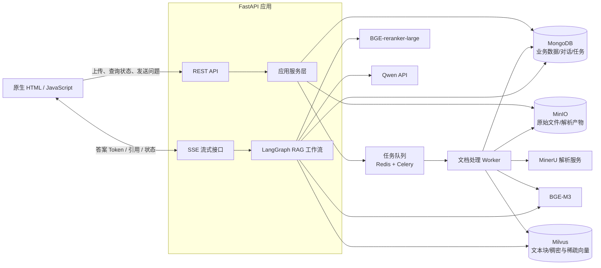

# 知识库问答系统整体架构设计

> 本文基于 [`schema.md`](./schema.md) 中的需求设计，目标是实现一个支持文档上传、异步解析、向量检索和流式 RAG 问答的知识库智能体。

## 1. 架构结论

项目初期推荐采用：

> 模块化单体 FastAPI + 独立文档处理 Worker + 三类专用存储

暂时不要拆成多个业务微服务。上传、对话、知识库管理放在一个 FastAPI 项目中；只有耗时的文档解析和向量化通过后台 Worker 执行。

这种设计具有以下优点：

- 容易理解一次请求从前端到数据库的完整过程。
- 本地开发和调试简单。
- 文档解析不会阻塞 Web 请求。
- 各层边界清晰，后续可以按压力拆分服务。

## 2. 整体架构



不同存储各负其责：

- MinIO 保存文件，包括原始 PDF、解析后的 Markdown、图片等。
- MongoDB 保存业务状态，包括文档信息、处理进度、会话、消息和任务。
- Milvus 保存用于检索的文本块及向量。
- Redis 保存后台任务和短期事件，不作为永久业务数据源。

不要把整份原始文件塞进 MongoDB，也不要让 Milvus 成为业务主数据库。MongoDB 是业务状态的真相源：只有 MongoDB 中的文档状态为 `READY`，文档才可以参与问答。

## 3. 部署结构

开发环境建议用 Docker Compose 启动基础设施，但 FastAPI 可以直接在本机运行，方便断点调试。

```text
Browser
   │
   ▼
FastAPI :8000
   ├── MongoDB :27017
   ├── MinIO :9000
   ├── Milvus :19530
   ├── Redis :6379
   └── Qwen / Embedding / Reranker API

Celery Worker
   ├── Redis
   ├── MinIO
   ├── MongoDB
   ├── Milvus
   └── MinerU API
```

各进程的职责如下：

| 进程或组件 | 职责 | 不应该承担的职责 |
| --- | --- | --- |
| FastAPI | 接口、参数校验、业务编排、SSE | 不执行耗时文档解析 |
| Ingestion Worker | 解析、切块、向量化、索引 | 不直接处理浏览器请求 |
| MinerU | 文档结构提取 | 不管理知识库状态 |
| Redis | Celery 队列、短期事件 | 不保存永久业务数据 |
| MongoDB | 永久业务状态 | 不存大文件和向量 |
| MinIO | 文件与解析产物 | 不保存会话关系 |
| Milvus | 文本块及向量检索 | 不作为文档状态真相源 |

## 4. 系统分层

### 4.1 API 层

API 层负责 HTTP 世界里的事情：

```text
读取请求
参数校验
调用应用服务
把异常转换成 HTTP 状态码
返回 JSON 或 SSE
```

路由中不应该直接出现 Milvus 插入、MinerU 解析或 Embedding 调用。

### 4.2 Application 应用服务层

应用服务层负责组织完整用例，例如：

```text
upload_document()
delete_document()
retry_ingestion()
create_conversation()
start_chat_run()
```

它决定业务操作顺序，但不关心 MongoDB、MinIO 等客户端的具体调用方式。

### 4.3 Domain 领域层

领域层保存核心概念和规则：

```text
Document
DocumentStatus
Conversation
Message
Citation
Chunk
```

例如，文档状态不能随意跳转：

```text
UPLOADED → PARSING
PARSING  → CHUNKING 或 FAILED
CHUNKING → EMBEDDING 或 FAILED
EMBEDDING → INDEXING 或 FAILED
INDEXING → READY 或 FAILED
```

`READY` 文档如果需要重新解析，应创建新的索引版本，而不是直接覆盖线上正在使用的数据。

### 4.4 Infrastructure 基础设施层

基础设施层封装所有外部组件：

```text
MongoDocumentRepository
MinioObjectStorage
MilvusChunkRepository
MinerUClient
QwenChatModel
BgeEmbeddingModel
BgeReranker
```

上层依赖抽象接口，而不是在业务逻辑中到处直接使用厂商客户端。

依赖方向保持为：

```text
API → application → domain
                 ↘ infrastructure
```

## 5. 文档入库链路

### 5.1 完整流程

```text
用户上传
  → FastAPI 校验类型和大小
  → 文件流写入 MinIO
  → MongoDB 创建 document，状态 UPLOADED
  → 投递后台任务
  → Worker 调用 MinerU
  → 清洗解析结果
  → 按标题、段落、页码切块
  → BGE-M3 批量生成稠密和稀疏向量
  → 写入 Milvus
  → MongoDB 将文档状态改为 READY
```

建议使用以下状态机：

```text
UPLOADING
  → UPLOADED
  → PARSING
  → CHUNKING
  → EMBEDDING
  → INDEXING
  → READY

任意处理阶段失败 → FAILED
```

不要在上传 HTTP 请求中直接完成 MinerU 解析和 Embedding。复杂文档可能处理较久，HTTP 请求容易超时，失败后也难以重试。

### 5.2 上传接口内部流程

第一版可以让文件经过 FastAPI 上传到 MinIO：

```text
1. 校验扩展名、MIME 和文件大小
2. 一边读取文件，一边计算 SHA-256
3. 分块、流式写入 MinIO
4. 创建 MongoDB document
5. 创建 ingestion_job
6. 提交 Celery 任务
7. 返回 document_id
```

不要一次性执行 `await file.read()` 把整个大文件放进内存，应当分块读取和上传。

MinIO 对象路径建议如下：

```text
knowledge-agent/
├── raw/{kb_id}/{doc_id}/original.pdf
├── parsed/{kb_id}/{doc_id}/{version}/document.md
├── parsed/{kb_id}/{doc_id}/{version}/content_list.json
└── parsed/{kb_id}/{doc_id}/{version}/images/...
```

初期可以只使用一个 Bucket，通过对象 key 前缀分类。

### 5.3 重复文件

计算 SHA-256 后，按照下面的组合查询重复文档：

```text
knowledge_base_id + sha256
```

如果同一知识库已经存在相同的 `READY` 文档，可以返回：

```json
{
  "code": "DOCUMENT_ALREADY_EXISTS",
  "existing_document_id": "doc_id"
}
```

不要只使用文件名判断重复，因为不同文件可能同名。

## 6. Worker 流水线和幂等

Worker 不建议写成一个很长的大函数，而应拆成明确阶段：

```python
async def ingest_document(document_id):
    source = download_source(document_id)
    parsed = parse_document(source)
    normalized = normalize_document(parsed)
    chunks = split_document(normalized)
    vectors = embed_chunks(chunks)
    index_chunks(chunks, vectors)
    mark_ready(document_id)
```

每完成一个阶段都更新 MongoDB：

```json
{
  "status": "PROCESSING",
  "stage": "EMBEDDING",
  "progress": 65
}
```

Celery 任务可能重复执行，所以每一步必须允许重试：

- `document_version` 标识本次索引版本。
- `chunk_id` 根据文档版本和块序号确定性生成。
- Milvus 使用 upsert，而不是无条件 insert。
- `READY` 之前不能参与检索。
- 只有全部 chunk 写入成功后，才切换文档的活动版本。

推荐使用版本切换方式重新索引：

```text
旧版本 v1：正常参与检索
新版本 v2：写入但暂不参与检索
v2 全部完成
MongoDB active_version 改为 2
异步清理 v1
```

这样重新索引失败时，旧版本仍然可以使用。

## 7. 文档切块策略

切块质量通常比更换大模型更影响 RAG 效果。

不要只按固定字符数切割。MinerU 已提取标题、段落、页码和表格等结构，应优先使用结构化切块：

```text
一级标题
  └── 二级标题
       ├── 段落块
       ├── 表格块
       └── 列表块
```

第一版建议：

- 普通段落目标长度约为 400～700 个中文字符。
- 重叠比例约为 10%～15%。
- 将标题路径附加到每个 chunk。
- 表格尽量作为完整块，不从行中间截断。
- 保存页码或页码范围。
- 合并过短的相邻段落。
- 超长块再按照句子边界切分。

用于 Embedding 的文本可以是：

```text
文档：员工管理制度
章节：第三章 > 请假管理

员工申请年假时，应提前……
```

每个 chunk 同时保留原文和用于向量化的增强文本：

```json
{
  "content": "实际正文",
  "embedding_content": "带标题路径的正文",
  "section_path": ["第三章", "请假管理"],
  "page_start": 12,
  "page_end": 13
}
```

展示引用时使用 `content`，生成向量时使用 `embedding_content`。

## 8. MongoDB 数据模型

### 8.1 `knowledge_bases`

```json
{
  "_id": "kb_id",
  "name": "默认知识库",
  "description": "",
  "created_at": "datetime",
  "updated_at": "datetime"
}
```

即使第一版只有一个知识库，也应保留 `knowledge_base_id`，避免以后增加多知识库时重构全部数据。

### 8.2 `documents`

```json
{
  "_id": "doc_id",
  "knowledge_base_id": "kb_id",
  "filename": "example.pdf",
  "mime_type": "application/pdf",
  "size": 102400,
  "sha256": "...",
  "object_key": "raw/kb_id/doc_id/example.pdf",
  "status": "READY",
  "stage": "INDEXING",
  "progress": 100,
  "active_version": 1,
  "chunk_count": 83,
  "parser_version": "mineru-version",
  "embedding_model": "bge-m3",
  "embedding_version": "model-version",
  "error": null,
  "created_at": "datetime",
  "updated_at": "datetime"
}
```

必须保存解析器、Embedding 和切块规则的版本，否则以后无法准确判断哪些文档需要重建索引。

### 8.3 `conversations`

```json
{
  "_id": "conversation_id",
  "knowledge_base_id": "kb_id",
  "title": "自动生成的标题",
  "created_at": "datetime",
  "updated_at": "datetime"
}
```

### 8.4 `messages`

```json
{
  "_id": "message_id",
  "conversation_id": "conversation_id",
  "role": "assistant",
  "content": "问题或答案",
  "status": "completed",
  "citations": [
    {
      "chunk_id": "chunk_id",
      "document_id": "doc_id",
      "filename": "example.pdf",
      "page": 12
    }
  ],
  "created_at": "datetime"
}
```

### 8.5 `ingestion_jobs`

用于保存任务阶段、重试次数和详细错误。不要只依赖 Redis 队列中的临时任务状态。

```json
{
  "_id": "job_id",
  "document_id": "doc_id",
  "document_version": 1,
  "status": "RUNNING",
  "stage": "PARSING",
  "progress": 20,
  "retry_count": 0,
  "error": null,
  "created_at": "datetime",
  "updated_at": "datetime"
}
```

### 8.6 `chat_runs`

用于管理一次流式问答运行：

```json
{
  "_id": "run_id",
  "conversation_id": "conversation_id",
  "user_message_id": "message_id",
  "assistant_message_id": null,
  "status": "PENDING",
  "error": null,
  "created_at": "datetime",
  "updated_at": "datetime"
}
```

## 9. Milvus Collection 设计

Collection 可以命名为 `knowledge_chunks`：

```text
chunk_id          VARCHAR，主键
knowledge_base_id VARCHAR
document_id       VARCHAR
document_version  INT
chunk_index       INT
page_start        INT
page_end          INT
section_path      VARCHAR 或 JSON
content           TEXT/VARCHAR
content_hash      VARCHAR
dense_vector      FLOAT_VECTOR，维度 1024
sparse_vector     SPARSE_FLOAT_VECTOR
is_active         BOOL
```

查询必须带上知识库和活动版本过滤条件，防止知识库之间串数据：

```text
knowledge_base_id == 当前知识库
and is_active == true
```

`chunk_id` 应确定性生成，例如：

```text
sha256(document_id + document_version + chunk_index)
```

Worker 重试时，相同 chunk 会覆盖而不是重复插入。

Milvus 支持在同一 Collection 中保存稠密和稀疏向量，并执行混合检索。BGE-M3 产生的两类表示可以落在同一条 chunk 记录中。

## 10. RAG 问答链路

```text
用户问题
  → 保存用户消息
  → 根据历史消息改写独立问题
  → BGE-M3 生成查询向量
  → Milvus 稠密 + 稀疏混合检索
  → BGE-reranker-large 重排
  → 组装上下文和来源
  → Qwen 流式生成答案
  → SSE 推送 Token 和引用
  → 保存最终答案
```

推荐使用下面的初始检索参数：

```text
稠密召回 Top 30
稀疏召回 Top 30
RRF 或加权融合
重排候选 Top 20
最终送给 LLM Top 5～8
```

这些数字只是合理的初始值，后续应通过真实测试问题集调优。

`BGE-reranker-large（512 序列）` 中的 512 通常表示最大输入序列长度，而不是输出向量维度。Reranker 输出的是候选文本和问题之间的相关性分数。

## 11. 检索服务

把检索封装成独立服务：

```python
class Retriever:
    async def retrieve(
        self,
        query: str,
        knowledge_base_id: str,
        document_ids: list[str] | None = None,
    ) -> list[RetrievedChunk]:
        ...
```

内部流程：

```text
query
  ├── BGE-M3 dense embedding
  └── BGE-M3 sparse embedding
             ↓
       Milvus hybrid search
             ↓
       去重、融合、截断
             ↓
       BGE reranker
             ↓
       RetrievedChunk[]
```

统一返回对象：

```python
class RetrievedChunk:
    chunk_id: str
    document_id: str
    content: str
    filename: str
    section_path: list[str]
    page_start: int | None
    page_end: int | None
    retrieval_score: float
    rerank_score: float
```

LangGraph 不需要知道 Milvus 的原始 hit 对象结构，只处理统一的 `RetrievedChunk`。

### 无证据处理

不要要求模型无论如何都生成答案：

```text
没有召回结果
或最高重排分数低于阈值
    ↓
回答“知识库中没有找到足够依据”
```

分数阈值需要通过测试集确定，不能直接凭感觉作为最终值。

## 12. LangGraph 工作流

项目初期不需要一个可以任意调用工具的复杂 Agent。建议把 LangGraph 用作状态明确的 RAG 工作流：

```text
load_conversation
        ↓
rewrite_question
        ↓
retrieve_chunks
        ↓
rerank_chunks
        ↓
check_evidence
     ↙       ↘
generate    insufficient_evidence
     ↓
persist_answer
```

Graph State 只保存工作流需要的数据：

```text
question
standalone_question
conversation_id
knowledge_base_id
retrieved_chunks
reranked_chunks
answer
citations
```

不要把数据库连接、模型客户端或整份文档放进 State。

应明确区分两种持久化：

- MongoDB `messages` 是产品真正展示的聊天记录。
- LangGraph checkpoint 是工作流恢复和调试状态。

不能只保存 checkpoint 而没有正式的消息数据模型。

## 13. Prompt 结构

生成节点建议使用严格模板：

```text
系统要求：
你是知识库问答助手。
只能根据提供的资料回答。
资料不足时明确说明不知道。
不要编造来源。
回答中的事实应标注引用编号。

历史对话：
...

用户问题：
...

检索资料：
[1] 文件：制度.pdf，第 12 页
内容：...

[2] 文件：手册.pdf，第 3 页
内容：...
```

模型输出的 `[1]`、`[2]` 只能引用本次提供的候选块。服务端还要将编号转换成结构化 citation，不能只把引用留在纯文本中。

## 14. API 设计

### 14.1 知识库和文档

```http
POST   /api/v1/knowledge-bases
GET    /api/v1/knowledge-bases

POST   /api/v1/knowledge-bases/{kb_id}/documents
GET    /api/v1/knowledge-bases/{kb_id}/documents
GET    /api/v1/documents/{doc_id}
DELETE /api/v1/documents/{doc_id}
POST   /api/v1/documents/{doc_id}/retry
```

上传接口成功只代表已接收文档，不代表向量已入库：

```json
{
  "document_id": "doc_id",
  "status": "UPLOADED"
}
```

前端通过 `GET /documents/{doc_id}` 查询和展示处理进度。

### 14.2 对话

```http
POST /api/v1/conversations
GET  /api/v1/conversations/{conversation_id}/messages

POST /api/v1/conversations/{conversation_id}/runs
GET  /api/v1/runs/{run_id}/events
```

交互过程：

1. 浏览器通过 POST 提交问题，得到 `run_id`。
2. 浏览器创建 `EventSource("/api/v1/runs/{run_id}/events")`。
3. 服务端推送检索状态、答案 Token、引用和结束事件。

SSE 事件建议如下：

```text
event: status
data: {"stage":"retrieving"}

event: citation
data: {"document":"example.pdf","page":12}

event: token
data: {"text":"根据"}

event: completed
data: {"message_id":"message_id"}

event: error
data: {"code":"MODEL_ERROR","message":"生成失败"}
```

采用“先 POST 创建运行，再 GET 订阅事件”，是因为 SSE 是服务端到客户端的单向通道，浏览器原生 `EventSource` 适合连接一个事件 URL，不适合直接携带复杂的 POST 请求体。

## 15. SSE 可靠性

完整流程可以设计为：

```text
POST /runs
  → 保存用户消息
  → 创建 run(status=PENDING)
  → 返回 run_id

GET /runs/{run_id}/events
  → 原子地把 PENDING 改为 RUNNING
  → 执行 LangGraph
  → 持续推送事件
  → 保存 assistant message
  → run 改为 COMPLETED
```

事件最好包含递增序号：

```text
id: 1
event: status
data: {"stage":"retrieving"}

id: 2
event: token
data: {"text":"根据"}

id: 3
event: token
data: {"text":"该制度"}
```

第一版可以由 FastAPI 进程直接执行并推送。后续如果部署多个 API 实例，或者希望浏览器断线后模型继续生成，可以升级为：

```text
Chat Worker → Redis Stream → FastAPI SSE → Browser
```

浏览器带着 `Last-Event-ID` 重连后，可以从上次事件继续读取。第一版先不加入这部分复杂度。

服务端还应每隔约 15～30 秒发送 SSE 注释作为心跳：

```text
: heartbeat
```

如果部署了反向代理，需要关闭 SSE 响应缓冲。

## 16. 删除文档

一个文档的数据分布在三个存储中：

```text
MongoDB document
MinIO objects
Milvus chunks
```

为了避免删除到一半造成数据不一致，建议采用以下流程：

```text
1. MongoDB 标记 DELETING
2. 检索立即排除该文档
3. 删除 Milvus chunks
4. 删除 MinIO 对象
5. MongoDB 标记 DELETED
```

任一步失败都保留错误状态，由后台任务继续重试。

学习阶段建议先做软删除，不立即执行物理删除：

```json
{
  "status": "DELETED",
  "deleted_at": "datetime"
}
```

等完整流程稳定后，再增加定期物理清理。

## 17. 错误分类

不要只保存一段“处理失败”。建议使用统一错误码：

```text
UNSUPPORTED_FILE_TYPE
FILE_TOO_LARGE
OBJECT_STORAGE_ERROR
PARSER_TIMEOUT
PARSER_OUTPUT_INVALID
CHUNKING_ERROR
EMBEDDING_RATE_LIMIT
EMBEDDING_ERROR
MILVUS_WRITE_ERROR
RETRIEVAL_ERROR
RERANK_ERROR
LLM_ERROR
CLIENT_DISCONNECTED
```

对用户显示友好信息，对日志保存完整技术细节：

```json
{
  "error": {
    "code": "PARSER_TIMEOUT",
    "message": "文档解析超时",
    "retryable": true,
    "detail": "具体堆栈只记录在服务端日志"
  }
}
```

## 18. 推荐代码目录

```text
KnowledgeAgent/
├── app/
│   ├── main.py
│   ├── api/
│   │   ├── documents.py
│   │   ├── conversations.py
│   │   └── runs.py
│   ├── application/
│   │   ├── document_service.py
│   │   ├── ingestion_service.py
│   │   └── chat_service.py
│   ├── domain/
│   │   ├── document.py
│   │   ├── conversation.py
│   │   └── chunk.py
│   ├── rag/
│   │   ├── graph.py
│   │   ├── state.py
│   │   ├── retriever.py
│   │   ├── reranker.py
│   │   └── prompts.py
│   ├── infrastructure/
│   │   ├── mongodb.py
│   │   ├── minio.py
│   │   ├── milvus.py
│   │   ├── mineru.py
│   │   └── models.py
│   ├── workers/
│   │   └── ingest_document.py
│   └── web/
│       ├── index.html
│       ├── app.js
│       └── style.css
├── tests/
├── docker-compose.yml
├── pyproject.toml
└── .env.example
```

这只是后续实现时的目录建议，应该随着每个阶段逐步建立，不需要一开始一次性创建所有空文件。

## 19. 分阶段实施顺序

不要一开始同时接入全部模型和中间件。

### 第一阶段：文件上传

只完成：

```text
上传文件
  → MinIO 保存成功
  → MongoDB 保存文档记录
  → 页面展示文档列表和状态
```

暂时不接入 MinerU、Celery、Milvus、Embedding、LangGraph 和 LLM。

完成标准：

1. 能上传一个 PDF。
2. MinIO 中能看到对象。
3. MongoDB 中能看到对应元数据。
4. 能识别同一知识库中的重复文件。
5. 上传时不会把整个文件一次性读入内存。
6. 页面刷新后仍能看到文档记录。
7. MinIO 写入失败时，不会留下伪 `READY` 数据。

### 第二阶段：文档解析

接入 MinerU，完成：

```text
上传 → 异步解析 → 保存 Markdown 和结构化结果 → 页面展示解析状态
```

### 第三阶段：文档切块

实现结构化切块，并提供仅供开发调试的 chunk 查看能力。先人工检查标题、页码、表格有没有被错误切断。

### 第四阶段：检索

接入 BGE-M3 和 Milvus，先实现一个独立检索接口。输入问题后只返回原文片段和分数，不调用大模型。

### 第五阶段：重排

接入 BGE-reranker-large，对比加入重排前后的召回顺序，并使用测试问题集评估。

### 第六阶段：单轮 RAG

接入 Qwen，使用检索结果生成带引用的单轮答案。

### 第七阶段：多轮对话

使用 LangGraph 组织历史消息加载、问题改写、检索、证据判断、生成和持久化。

### 第八阶段：工程可靠性

加入 SSE、断线处理、任务重试、软删除、重新索引、日志、指标和 RAG 评测。

第 4 阶段尤其重要：必须先确认“检索能够找到正确原文”，再接入 LLM。否则回答错误时，很难判断问题出在切块、Embedding、召回、重排还是 Prompt。

## 20. 总结

整个系统可以概括为：

> 一个 FastAPI 模块化单体承载业务接口，一个独立 Worker 承载文档入库任务；MinIO 存文件，MongoDB 存业务状态，Milvus 存可检索文本块；LangGraph 只编排 RAG 工作流，不接管全部业务逻辑。

## 21. 参考资料

- [Milvus：Multi-Vector Hybrid Search](https://milvus.io/docs/multi-vector-search.md)
- [Milvus：Search Patterns](https://milvus.io/docs/search_patterns.md)
- [LangGraph：Persistence](https://docs.langchain.com/oss/python/langgraph/persistence)
- [LangGraph：Streaming](https://docs.langchain.com/oss/python/langgraph/streaming)
- [MinerU：Quick Usage](https://github.com/opendatalab/MinerU/blob/master/docs/en/usage/quick_usage.md)
- [FastAPI：StreamingResponse](https://fastapi.tiangolo.com/advanced/custom-response/)
- [MDN：Using server-sent events](https://developer.mozilla.org/en-US/docs/Web/API/Server-sent_events/Using_server-sent_events)
